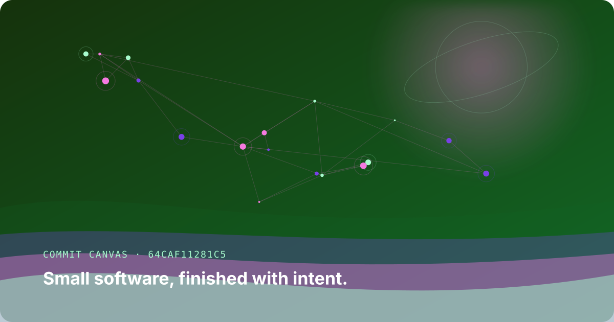

# Commit Canvas

Turn a phrase or commit message into a deterministic piece of generative SVG art.
The same text always produces the same composition, which makes each image a
visual fingerprint for an idea.



## Try it

No third-party packages are required.

```bash
python3 commit_canvas.py "Small software, finished with intent." \
  --output examples/my-canvas.svg
```

Open the resulting SVG in any browser. Change the phrase and the palette,
constellation, horizon, and orbital details all change with it.

## How it works

1. SHA-256 expands the input phrase into a deterministic stream of bytes.
2. That stream selects a harmonious HSL palette and positions visual elements.
3. The renderer builds layered gradients, flowing paths, and a connected star map.
4. Text is escaped before being embedded, so arbitrary phrases remain valid SVG.

The generator deliberately avoids Python's pseudorandom module. Its output is
stable across processes and Python versions because every choice comes directly
from cryptographic hash bytes.

## Engineering notes

- The output is plain, inspectable SVG rather than a binary canvas export.
- The CLI validates dimensions and creates missing output directories.
- Tests cover determinism, input sensitivity, XML escaping, dimensions, and file
  output.
- The project uses only the Python standard library.

## Test it

From this directory:

```bash
python3 test_commit_canvas.py
```

## Limitations and next ideas

The layout is designed for landscape cards rather than arbitrary aspect ratios.
A future version could expose style families or generate an animated transition
between two commit messages while preserving deterministic output.
