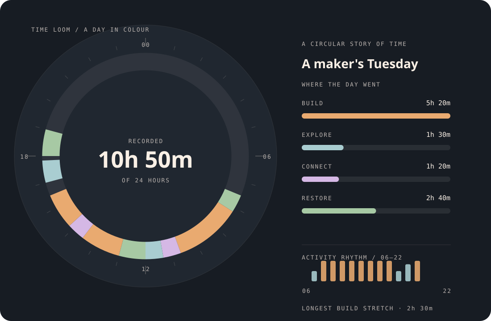

# Time Loom

Turn a plain schedule into a circular story of where a day went—and measure the
uninterrupted stretches that matter more than a packed calendar.



## Run it

Requires Node.js 22 or newer; no packages, account, network, or credentials.

```bash
node time_loom.mjs examples/sample-day.json examples/my-day.svg
node --test test_time_loom.mjs
```

Open the SVG in a browser. The sample data is fictional. Replace it with your own
`title` and `blocks` to make another image. Each block has `start`, `end`
(`HH:MM`), `category`, and `label`:

```json
{
  "title": "An afternoon in motion",
  "blocks": [
    { "start": "13:00", "end": "14:30", "category": "build", "label": "Make something" }
  ]
}
```

Categories are `build`, `explore`, `connect`, and `restore`. Unrecorded time is
shown as quiet space on the 24-hour ring, rather than pretending every hour was
productive. Titles are limited to 32 characters so they fit the card.

## Decisions behind the picture

- The clock always spans a full day. Segments keep their real duration instead
  of expanding to fill empty time.
- Four fixed, legible colors avoid a palette that changes meaning between days.
- The inner figure shows recorded hours, not a fabricated productivity score.
- The activity rhythm is binned by exact minute overlap across hourly boundaries.
- The longest single `build` block is shown separately: total build time alone
  can hide a fragmented day.
- SVG titles describe each segment and hour, while the overall description
  summarizes the categories for assistive technology.

Blocks may arrive out of order, but may not overlap or cross midnight. Split
overnight work into two records. `24:00` is accepted only as an end time. These
constraints make the data and resulting graphic unambiguous.

## Limitations

This is a one-day lens, not a calendar integration or time tracker. It does not
infer intent or quality from duration. A useful next experiment would compare
multiple days while preserving the same colors and reporting uncertainty from
missing records.
