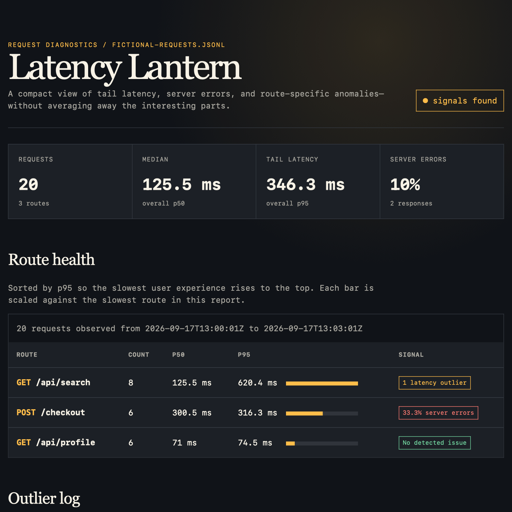

# Latency Lantern

Turn newline-delimited request logs into a focused, standalone diagnostic report
that reveals slow tails, server errors, and route-specific anomalies.



## Run it

Requires Node.js 22 or newer; no packages, account, network, or credentials.

```bash
# Inspect the structured analysis in the terminal
node latency_lantern.mjs examples/fictional-requests.jsonl

# Generate an HTML report you can open or send as one file
node latency_lantern.mjs examples/fictional-requests.jsonl --html report.html

# Save the analysis for another tool
node latency_lantern.mjs examples/fictional-requests.jsonl --json report.json

node --test test_latency_lantern.mjs
```

Each nonblank input line is one JSON object:

```json
{"timestamp":"2026-09-17T13:00:01Z","method":"GET","route":"/api/search","duration_ms":118,"status":200}
```

The included log is fictional. Malformed lines fail with their source line number
rather than being silently dropped. The HTML output escapes log-derived text and
contains its own styles, so it works offline without scripts, fonts, or telemetry.
Output and input paths must differ, preventing a mistyped command from replacing
the source log.

## Decisions behind the diagnostics

- **Show p50 and p95, not one average.** The median describes a typical request;
  p95 keeps a slow minority visible.
- **Compare a route with itself.** `GET /profile` and `POST /checkout` may have
  very different healthy baselines, so outliers are detected per method/route.
- **Use robust statistics.** A modified z-score based on median absolute deviation
  prevents an extreme request from moving the baseline that judges it. When every
  baseline value is identical, a conservative absolute-and-relative threshold
  catches a lone slow request.
- **Separate failure from slowness.** HTTP 5xx responses are counted as server
  errors; they do not automatically become latency outliers.
- **Keep the report inspectable.** The renderer uses semantic tables and no
  client-side JavaScript. JSON remains available for pipelines.

## Limitations

Latency Lantern analyzes one bounded file in memory. It is not a live monitor,
distributed trace viewer, or root-cause engine. Sparse routes can produce unstable
percentiles, clock order is reported but not used to infer causality, and only 5xx
statuses count as errors. A production evolution could add streaming aggregation,
sample-size warnings, configurable service-level thresholds, and comparisons
between releases while preserving the zero-dependency local workflow.
