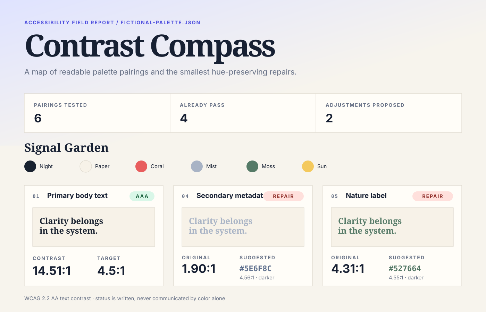

# Contrast Compass

Turn a brand palette into a map of accessible text pairings—and find the
smallest hue-preserving lightness repair when a pairing misses its target.



## Run it

Requires Python 3.9 or newer; no packages, browser scripts, accounts, network,
or credentials.

```bash
# Inspect structured results in the terminal
python3 contrast_compass.py examples/fictional-palette.json

# Generate the standalone visual report
python3 contrast_compass.py examples/fictional-palette.json --html report.html

# Save machine-readable results
python3 contrast_compass.py examples/fictional-palette.json --json report.json

python3 test_contrast_compass.py
```

The input names a palette, then declares the foreground/background combinations
that the design actually intends to use. Each pair identifies its role and
whether it is normal or large text:

```json
{
  "role": "Secondary metadata",
  "foreground": "Mist",
  "background": "Paper",
  "size": "normal"
}
```

The included “Signal Garden” palette is fictional. Output and input paths must
differ, preventing a mistyped command from replacing the source palette.

## Decisions behind the compass

- **Audit uses, not isolated colors.** Accessibility belongs to a foreground,
  background, text size, and purpose—not to a swatch by itself.
- **Implement the published color math.** sRGB channels are linearized with the
  current `0.04045` breakpoint before relative luminance and contrast are
  calculated. The report applies the [WCAG 2.2 contrast minimum][wcag]: 4.5:1
  for normal text and 3:1 for large text.
- **Preserve visual identity.** A repair keeps the foreground hue and saturation,
  searches every 8-bit HSL lightness step, and returns the smallest change that
  still passes after conversion back to a six-digit hex value.
- **Keep evidence visible.** Every card shows the original pairing, numeric ratio,
  declared threshold, written status, and repaired sample when needed. Meaning
  never depends on badge color alone.
- **Stay portable.** The report is one semantic, responsive HTML file with no
  JavaScript, remote fonts, analytics, or telemetry.

## Limitations

Contrast Compass evaluates opaque six-digit sRGB colors on solid backgrounds.
It does not inspect typography, font weight, gradients, images, transparency,
focus states, non-text UI boundaries, or the rest of an accessibility standard.
The author must correctly classify large text. HSL lightness is a practical,
explainable repair axis, not a perceptually uniform color-difference metric.

[wcag]: https://www.w3.org/TR/WCAG22/#contrast-minimum
